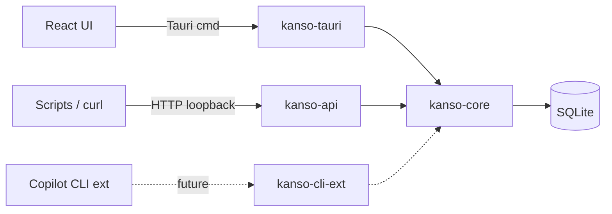

# Architecture

> Status: skeleton. Sections marked **TODO** are filled during Phase 1+.

## Overview

**TODO — fill in during Phase 1+.**

kanso is a single-user, local-first Kanban app. One Tauri window, one tray icon, one SQLite database. The same domain logic is exposed through three transports so the UI, scripts, and a future Copilot CLI extension all talk to the same core.

## Crate boundaries

**TODO — fill in during Phase 1+.**

- **`kanso-core`** — domain types (Board, Column, Card), repository traits, sqlx-backed implementations. Knows nothing about HTTP, Tauri, or React.
- **`kanso-api`** — axum router and handlers. Depends on `kanso-core`. Stateless; takes a repository handle.
- **`kanso-tauri`** — Tauri commands, tray menu, window lifecycle, axum bootstrap on loopback. Depends on `kanso-core` and `kanso-api`.
- **`kanso-cli-ext`** — Copilot CLI / MCP surface. Deferred to Phase 2+.

## Data model

**TODO — fill in during Phase 1+.**

- Fractional indexing for `position` (no full-list reorders on move).
- Soft delete via `archived_at: Option<DateTime<Utc>>`.

## Runtime model

**TODO — fill in during Phase 1+.**

Tray app, single window, axum in-process on loopback, SQLite file in the platform's app-data dir.

## Three transports

**TODO — fill in during Phase 1+.**

1. **Tauri commands** — primary path for the UI. Typed structs in / out.
2. **REST** (axum) — for scripts and external tools talking to the running app.
3. **MCP / CLI extension** — Phase 2+, reuses `kanso-core`.

## Diagram

